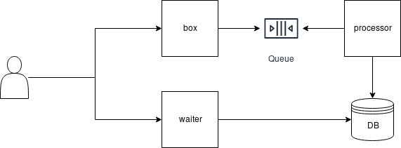

# filebox-doc

High-level documentation and tech-spec for filebox project and his components.

* to open diagrams use www.draw.io and import xml files from /diagrams foler.

##### SERVICES

1. **filebox-box**: it is the main gate and where user uploads the file.
1. **filbox-processor**: connected in a queue, is responsible to actual process files, validating, extracting, updating data and saving it in a object storage, making available to filebox-waiter.
1. **filbox-waiter**: it is how users interacting with filebox, serve a front-end/UI and REST API basically with endpoints to: list all files and retrieve a file.

##### COMPONENTS WORKFLOW

**box**

* represents the [filebox-box](https://github.com/eduardocerqueira/filebox-box) service running in Go a REST API to upload file.
* Might have a simple validation for: file extenstion(s) and max size allowed it is configured.
* integrated to a message queue or topic stream manager, e.g.: RabbitMQ, ApacheMQ or Kafka.

**processor**

* represents the [filebox-box](https://github.com/eduardocerqueira/filebox-processor) service running in Python and only internal do not serve any route for external access.
* listing to a queue or topic.
* digest the files performing: open, write/update, save and delete operations.
* the file content to be updated or deleted is configured.
* Has an inteface with object storage to persist the final file after being processed.

**waiter**

* represent the [filebox-box](https://github.com/eduardocerqueira/filebox-waiter) service running in Python and serving front-end/UI and REST API endpoint to: list, retrive and search for files.

**DB**
* The object storage and RDMS where files will be saved
* for object storage potentially using: [minIO](https://min.io) 
* for RDMS potentially using: [postgresql](https://www.postgresql.org/)
